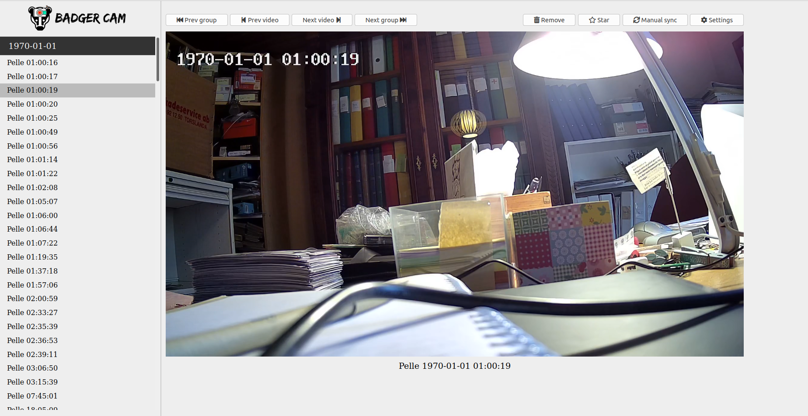
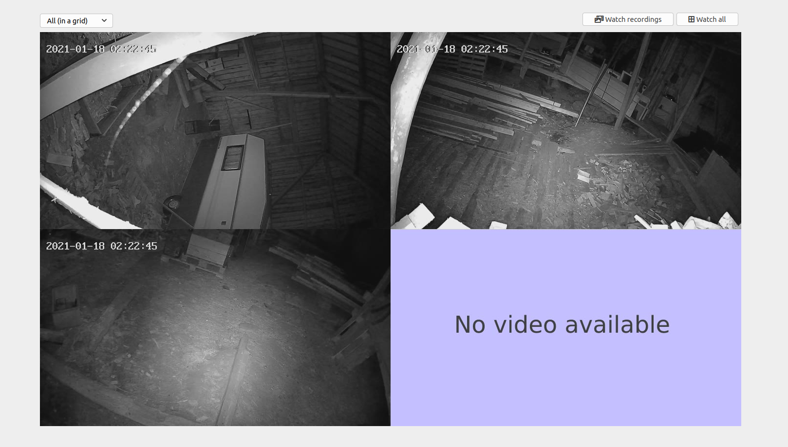

# BadgerCam
This project started as a way for me to easier handle the cameras I have monitoring a barn in order to figure out the movement patterns of some unwanted badgers who are ripping up the floor (hence the name). The app provided for the cameras was horrible to use so I quickly realized a homemade solution could make my life a lot easier. Unfortunately the company I bought my cameras off were very anti this kind of solution so I will avoid publicly publishing juicy details (e.g. telnet passwords, model names etc) in order to avoid their gazing eyes at me, and I appreciate if you do the same. If you have any private questions about these details, feel free to contact me via email (see [github profile](https://github.com/mzlarsson)) or on reddit ([u/pepparkvarn](https://www.reddit.com/user/pepparkvarn)).

In its current state, the software now syncs all video files from the camera (using telnet and netcat) and displays them in a list of recordings.

## Easy setup
The following sections will explain how to manually setup the project. However, I took the time to create a `Docker` container to make it so much easier instead. If you are more interested in the manual setup and not docker, skip the rest of this section. Another sidenote: At the moment this dockerfile is not optimized at all meaning its size is rather large. Updates for improving this will come shortly.

* Make sure you have `Docker` and `Docker compose` installed
* Download the `Dockerfile` and `docker-compose.yaml` to your device
* Edit the `docker-compose.yaml` so that the volumes match your requirements (we need one config file and one folder to sync videos to)
* Edit the config file from previous step to match your devices. See [the example file](https://github.com/mzlarsson/badgercam/blob/main/src/web/settings.json) for what data is needed.
* Run `docker-compose up` to build the image and start a container.
* Woop woop! All done! Visit the webpage [here](http://localhost:9674).

Too long? I made a script for you! (not 100% tested though)
```bash
# Get docker, skip if you already have it.
# Note: The below example uses a Debian-based system.
# Security note: See https://docs.docker.com/engine/install/debian/#install-using-the-convenience-script before proceeding.
curl -fsSL https://get.docker.com | sudo -E bash -
sudo usermod -aG docker $(whoami)

# Get docker-compose (pick one path). Skip if you already have it.
# -- Common linux distros, non-ARM
sudo curl -L "https://github.com/docker/compose/releases/download/1.27.4/docker-compose-$(uname -s)-$(uname -m)" -o /usr/local/bin/docker-compose
sudo chmod +x /usr/local/bin/docker-compose
# -- ARM (Raspberry Pi etc.)
sudo apt install -y python3-pip
sudo pip3 install docker-compose

# Create folders for data
sudo mkdir /opt/badgercam
sudo chown $(whoami):$(whoami) /opt/badgercam

# Fill with basic content (sync folder and settings file)
cd /opt/badgercam
mkdir synced_videos
wget https://raw.githubusercontent.com/mzlarsson/badgercam/main/src/web/settings.json

# Download docker configs
wget https://raw.githubusercontent.com/mzlarsson/badgercam/main/Dockerfile
wget https://raw.githubusercontent.com/mzlarsson/badgercam/main/docker-compose.yaml

# Prompt user to edit settings
nano settings.json

# Build dockerfile and run it
docker-compose up -d
```

## Required software
* Python 3 and Pip (for syncing)
* NodeJS and npm (for web)
* VLC (for converting videos)
* netcat (for syncing)

During development I have tested with *Python v3.8.5*, *VLC 3.0.9.2-0-gd4c1aefe4d (Vetinari)* on an *Ubuntu 20.04* distro. Since this is mainly for my own personal use I have not tested with other versions, please notify me if you find any issues concerning this. Testing that everything runs smoothly on a Windows machine is on the TODO list.

## Installation
1. Clone this repo. `git clone https://github.com/mzlarsson/badgercam.git`
2. Move into the directory. `cd badgercam`
3. Install pip dependencies. `pip install -r src/requirements.txt`
4. Move into web directory. `cd src/web`
5. Install required node modules. `npm install`
6. Yay. We are ready to go!

Note: If you are doing development it might be nice to create a virtual environment and activating it before running pip install. If that sounds like mambo jambo to you, ignore it.

### TL;DR
    git clone https://github.com/mzlarsson/badgercam.git
    cd badgercam
    pip install -r src/requirements.txt
    cd src/web
    npm install 

## Running the web page
The web page is a simple NodeJS app. If you are into web development, please forgive me. Sometimes the code quality falls rather low due to lack of experience of professional JS and CSS. In most cases the code will work fine though. Anyhoot, here is how you can run it.

1. Move to the directory where you cloned the repo, e.g. `cd ~/Documents/badgercam`
2. Move into the web source folder. `cd src/web`
3. Edit `settings.json` according to your needs. See examples in the file for syntax.
4. Start server by running `node index.js`
5. Site will be published under [http://localhost:9674](http://localhost:9674).

## Running the sync manually (advanced usage)
1. Move to the directory where you cloned the repo, e.g. `cd ~/Documents/badgercam`
2. Move into the source folder. `cd src`
3. Run sync script `python sync/sync.py [host] (options)`
    **host**: IP address (preferred) or hostname of target camera device
    Available options are as follows:
    **--remote-folder [folder]**: Folder on remote host where videos are located. Default: "/mnt/mmc1"
    **--sync-folder [folder]**: Folder on local computer to sync to. Default: "web/public/synced_videos"
    **--telnet-user [username]**: User to login as on telnet. Default: "root"
    **--telnet-pass [password]**: Password to use for telnet. Default: ""
    **--interface**: Name of interface card connected to network you want to use. Default: "wlan0"
4. You can now find the downloaded and converted files in the folder you specified with --sync-folder. By default this will be in the *web/public/synced_videos* folder (relative to where command was issued).

Example usage:

    python sync/sync.py 192.168.100.2 --remote-folder /mnt/mmc1 --telnet-pass secret_pw_here --interface wlp2s0

Note: The default settings for --sync-folder assumes you are running this script from the src folder of the repository. If you are not, please adjust that input option to make sure the videos are synced to your desired location.

### Upcoming changes
The web page is under rapid development atm. It might be buggy sometimes. Live support is in beta. I have plans to add a sidetrack feature too: "TV" mode! (preset screens with support for IR control).

### Screenshot(s) of webpage



## Known issues
### Auto-detecting IP addresses
The software auto detects the IP address by looking at the local ARP table of the server (a little lazy, I know). This means that if there have been no communication between these devices, the auto-detect IP feature will come up short. To counter this either ping the device from the server before syncing or add the IP manually in settings.json (see file for example).

## Licensing
This code is published under the MIT license.

> The MIT License (MIT)  
> Copyright (c) 2020 Matz Larsson
>
> Permission is hereby granted, free of charge, to any person obtaining a copy  
of this software and associated documentation files (the "Software"), to deal  
in the Software without restriction, including without limitation the rights  
to use, copy, modify, merge, publish, distribute, sublicense, and/or sell  
copies of the Software, and to permit persons to whom the Software is  
furnished to do so, subject to the following conditions:  
>
> The above copyright notice and this permission notice shall be included in  
all copies or substantial portions of the Software.  
>
> THE SOFTWARE IS PROVIDED "AS IS", WITHOUT WARRANTY OF ANY KIND, EXPRESS OR  
IMPLIED, INCLUDING BUT NOT LIMITED TO THE WARRANTIES OF MERCHANTABILITY,  
FITNESS FOR A PARTICULAR PURPOSE AND NONINFRINGEMENT. IN NO EVENT SHALL THE  
AUTHORS OR COPYRIGHT HOLDERS BE LIABLE FOR ANY CLAIM, DAMAGES OR OTHER  
LIABILITY, WHETHER IN AN ACTION OF CONTRACT, TORT OR OTHERWISE, ARISING FROM,  
OUT OF OR IN CONNECTION WITH THE SOFTWARE OR THE USE OR OTHER DEALINGS IN  
THE SOFTWARE.

